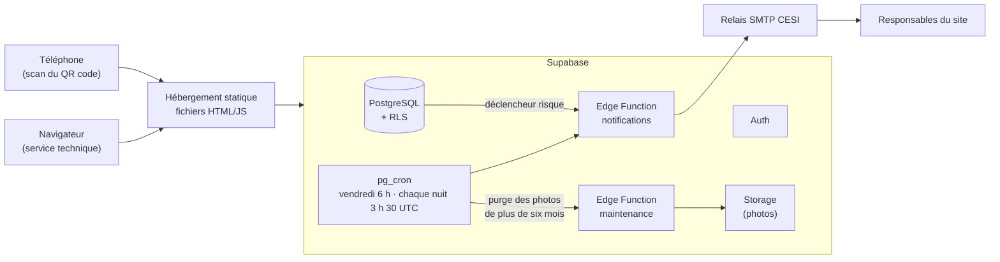

# CESI Helpdesk

Application de signalement et de suivi des incidents du campus CESI.
Un QR code est affiché dans chaque salle : le scanner ouvre un formulaire de
déclaration avec la salle déjà renseignée. Le service technique suit et traite
les demandes depuis un espace d'administration.

## Ce que fait l'application

**Pour la personne qui signale** — aucun compte nécessaire

- scanner le QR code de la salle, ou choisir la salle dans une liste avec autocomplétion ;
- décrire l'incident, cocher un ou plusieurs types, joindre une photo (compressée automatiquement) ;
- signaler un risque d'accident : une alerte part immédiatement par e-mail ;
- recevoir un numéro de demande à conserver.

**Pour le service technique** — connexion requise

- tableau de suivi avec un filtre par colonne, tri, et recherche ;
- quatre niveaux d'avancement : nouveau, en cours, en attente, terminé ;
- fiche complète de chaque incident, accessible par une URL partageable ;
- affectation d'un traitant et commentaire de résolution ;
- export Excel (`.xlsx`) de la sélection filtrée ;
- statistiques : volume mensuel, répartition par type, délai moyen de résolution, salles les plus touchées ;
- génération et impression des affiches à QR code, une par salle ;
- gestion des salles depuis l'application : ajout, renommage, désactivation ;
- gestion des comptes du personnel : rôle, activation, nom affiché ;
- récapitulatif hebdomadaire envoyé automatiquement le vendredi matin ;
- photos supprimées automatiquement six mois après la déclaration, le signalement restant dans l'historique.

## Stack technique

| Domaine | Choix |
| --- | --- |
| Interface | React 19, TypeScript, Vite 8 |
| Styles | Tailwind CSS v4 |
| Navigation | React Router (URL réelles, liens partageables) |
| Base de données | Supabase (PostgreSQL) avec Row Level Security |
| Authentification | Supabase Auth, rôles `admin` et `technicien` |
| Fichiers | Supabase Storage, bucket privé et URL signées |
| E-mails | Supabase Edge Function (Deno) + relais SMTP |
| Planification | `pg_cron` : récapitulatif hebdomadaire, purge nocturne des photos |

L'application est un site statique : aucun serveur applicatif à maintenir.



## Démarrage rapide

```bash
npm install && npx supabase start && npm run db:reset && npm run dev
```

Puis créez un compte administrateur :

```bash
bash scripts/creer-compte.sh admin@viacesi.fr 'VotreMotDePasse123!' "Votre Nom" admin
```

La procédure complète, y compris le rattachement à un projet Supabase hébergé,
est décrite dans **[docs/01-installation.md](docs/01-installation.md)**. Pour
faire tourner l'application et sa pile Supabase sur les serveurs de
l'établissement, voir **[docs/07-autohebergement.md](docs/07-autohebergement.md)**
et l'outillage du dossier [`deploy/`](deploy/).

## Commandes

| Commande | Rôle |
| --- | --- |
| `npm run dev` | serveur de développement (ajoutez `-- --host` pour tester depuis un téléphone) |
| `npm run build` | vérification TypeScript et build de production dans `dist/` |
| `npm run preview` | aperçu local du build |
| `npm run lint` | analyse ESLint |
| `npm run docs` | génère la référence d'API dans `docs/api/` |
| `npm run db:start` | démarre la pile Supabase locale (Docker requis) |
| `npm run db:reset` | recrée la base : migrations puis jeu de démonstration |
| `npm run db:push` | applique les migrations au projet Supabase distant |
| `npm run functions:serve` | sert les Edge Functions en local |
| `bash scripts/verifier-rls.sh` | vérifie les règles de sécurité de la base |
| `bash scripts/creer-compte.sh` | crée un compte du personnel |

## Documentation

| Document | Contenu |
| --- | --- |
| [01 — Installation](docs/01-installation.md) | Installer le projet depuis zéro |
| [02 — Architecture](docs/02-architecture.md) | Structure, choix techniques, ce qui n'a pas été fait |
| [03 — Base de données](docs/03-base-de-donnees.md) | Schéma, sécurité RLS, stockage des photos |
| [04 — Exploitation](docs/04-exploitation.md) | Ajouter une salle, créer un compte, dépanner |
| [05 — Guide utilisateur](docs/05-guide-utilisateur.md) | Mode d'emploi, déclarant et administrateur |
| [06 — Recette](docs/06-recette.md) | Cahier de tests et scénario de démonstration |
| [07 — Autohébergement](docs/07-autohebergement.md) | Déployer sur l'infrastructure de l'établissement (Proxmox + Nginx Proxy Manager) |
| [Décisions (ADR)](docs/adr/) | Pourquoi chaque choix structurant a été fait |

## État du projet

Toutes les fonctionnalités du cahier des charges sont implémentées et vérifiées
en local. Deux points demandent une action de l'établissement avant la mise en
service :

1. **Identifiants du relais SMTP.** Sans eux, les e-mails sont composés et
   journalisés mais pas envoyés (`MAIL_TRANSPORT=console`). Le passage à l'envoi
   réel ne demande aucune modification de code.
2. **Adresse publique de l'application** (`VITE_PUBLIC_APP_URL`), nécessaire
   avant d'imprimer les QR codes — sinon les affiches pointent vers `localhost`.

Les limites connues et les pistes d'évolution sont recensées dans
[docs/02-architecture.md](docs/02-architecture.md#ce-qui-na-pas-été-fait-et-pourquoi).
