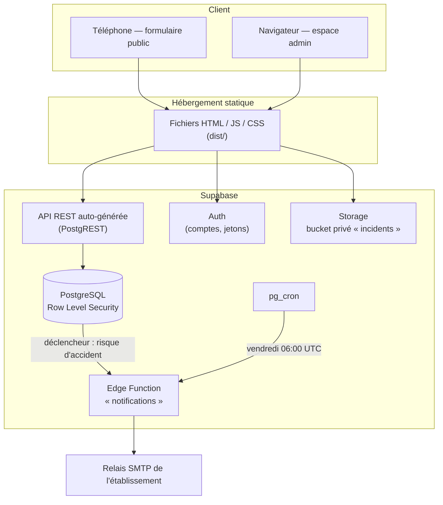
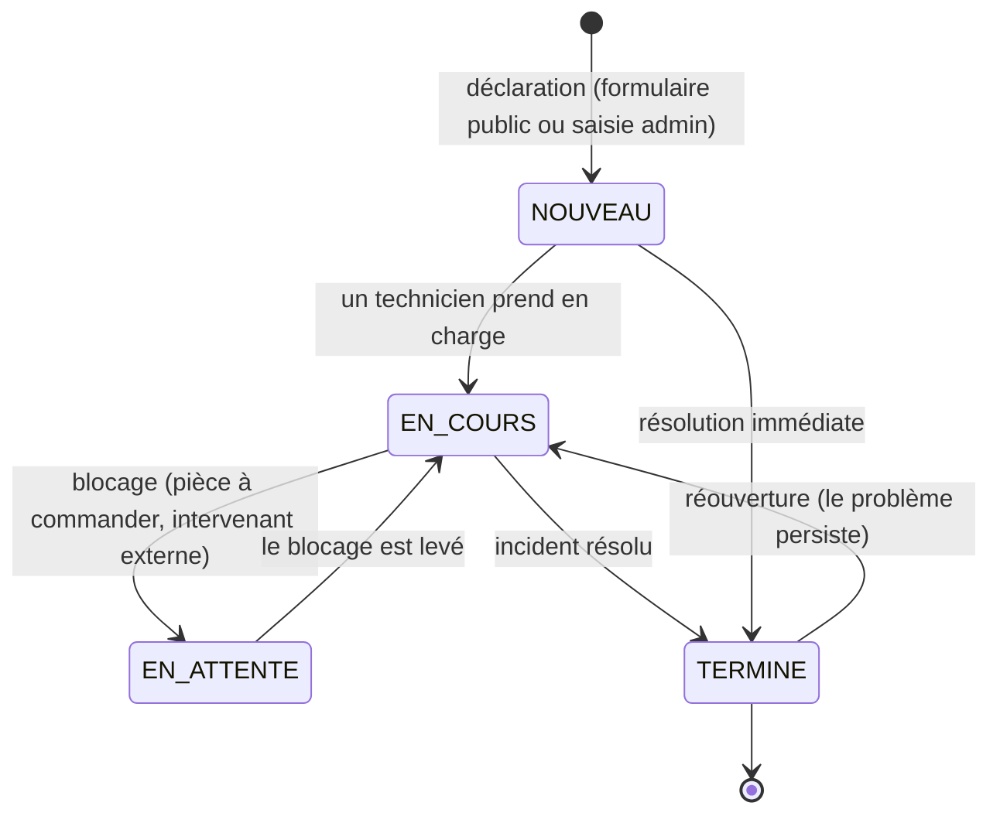
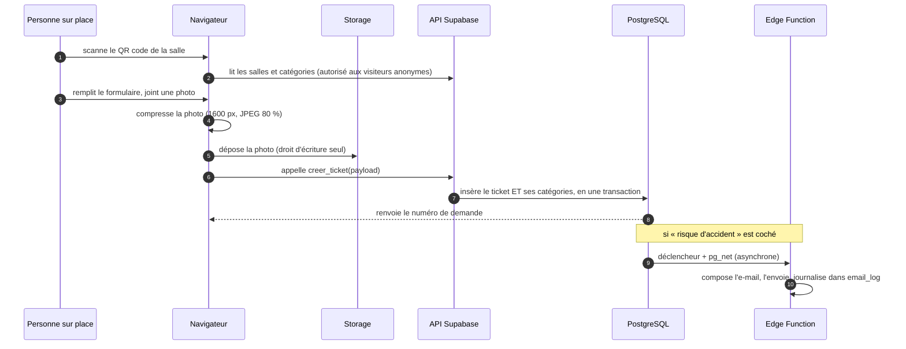
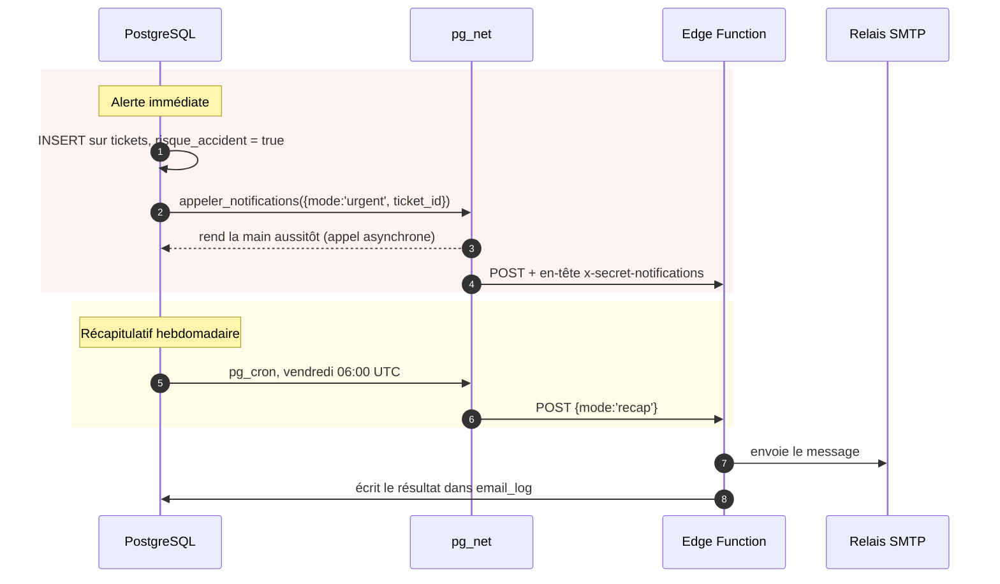

# 02 — Architecture

Ce document explique **comment le projet est construit et pourquoi**. Les
décisions structurantes ont chacune une fiche dédiée dans [`adr/`](adr/).

## Vision d'ensemble

L'application est un **site statique** qui parle directement à Supabase.
Il n'y a aucun serveur applicatif à héberger, surveiller ou mettre à jour.



**Conséquence importante :** la clé d'accès à l'API est publique, présente dans
le JavaScript envoyé à chaque visiteur. La sécurité ne repose donc jamais sur ce
que l'interface affiche ou masque, mais uniquement sur les règles définies dans
la base (voir [03 — Base de données](03-base-de-donnees.md)).

## Décisions structurantes

| Décision | Fiche |
| --- | --- |
| Tout sur Supabase, suppression du serveur Express/MySQL | [ADR-001](adr/ADR-001-supabase-plutot-que-mysql-express.md) |
| Sécurité par RLS plutôt que par contrôle applicatif | [ADR-002](adr/ADR-002-rls-plutot-que-controle-applicatif.md) |
| Création d'incident par fonction RPC | [ADR-003](adr/ADR-003-creation-par-fonction-rpc.md) |
| Compression des photos dans le navigateur, bucket privé | [ADR-004](adr/ADR-004-compression-image-cote-client.md) |
| E-mails déclenchés par la base, pas par le navigateur | [ADR-005](adr/ADR-005-emails-declenches-en-base.md) |
| Fiche incident : page routée plutôt que fenêtre modale | [ADR-006](adr/ADR-006-page-routee-plutot-que-modale.md) |
| Export `.xlsx` réel plutôt que CSV | [ADR-007](adr/ADR-007-export-xlsx.md) |
| Graphiques dessinés à la main, sans bibliothèque | [ADR-008](adr/ADR-008-graphiques-sans-bibliotheque.md) |
| Pas de table d'historique générique | [ADR-009](adr/ADR-009-pas-de-table-audit.md) |
| Tailwind seul, suppression des modules CSS | [ADR-010](adr/ADR-010-tailwind-seul.md) |

## Organisation du code

```text
src/
├── lib/supabase.ts        Client Supabase unique, partagé par toute l'application
├── types/                 Types TypeScript (helpdesk.ts, auth.ts)
├── data/helpdesk.ts       Libellés et couleurs des statuts — source unique
├── utils/                 Fonctions PURES, sans React ni réseau : directement testables
│   ├── ticketFilters.ts   Filtrage et tri du tableau de suivi
│   ├── ticketStats.ts     Calcul des indicateurs
│   ├── imageCompression.ts Redimensionnement et compression JPEG
│   └── qr.ts              Construction et lecture des liens de QR code
├── services/              Accès aux données : tout ce qui touche au réseau
│   ├── tickets.ts         Lecture, création (RPC) et mise à jour des incidents
│   ├── utilisateurs.ts    Annuaire du personnel et gestion des comptes
│   ├── helpdeskData.ts    Salles et catégories actives, avec cache de 5 minutes
│   ├── salles.ts          Gestion des salles (ajout, renommage, activation)
│   ├── storage.ts         Envoi des photos et URL signées
│   └── excelExport.ts     Génération du fichier .xlsx
├── context/               État partagé (authentification, notifications, tickets)
├── hooks/                 Accès à cet état (useAuth, useToast, useTickets…)
├── routes/                Table de routage et garde-fou d'accès
├── layouts/               Ossature commune des pages
├── pages/                 Un dossier par écran
└── components/            Composants réutilisables (forms, admin, charts, ui, layout)
```

**Règle de séparation :** `utils/` ne contient que des fonctions pures — c'est ce
qui permet de les tester sans navigateur ni base de données. Tout ce qui fait un
appel réseau vit dans `services/`. Un composant n'appelle jamais Supabase
directement : il passe par un service ou un contexte.

## Cycle de vie d'un incident



Le passage à `TERMINE` horodate automatiquement `tickets.resolu_le`, en base et
non côté application : le délai moyen de résolution affiché dans les
statistiques reste juste même si un statut est modifié directement en SQL. Un
retour en arrière efface l'horodatage.

## Parcours « signaler un incident »



Le point clé de l'étape 8 : le visiteur anonyme n'a **aucun droit** sur la table
`tickets`. Il ne peut qu'appeler une fonction qui valide les données et écrit à
sa place ([ADR-003](adr/ADR-003-creation-par-fonction-rpc.md)).

## Authentification et rôles

| Action | Anonyme | Technicien | Administrateur |
| --- | :---: | :---: | :---: |
| Déclarer un incident | ✅ | ✅ | ✅ |
| Voir les salles et les catégories | ✅ | ✅ | ✅ |
| Consulter les incidents | ❌ | ✅ | ✅ |
| Modifier statut, traitant, commentaire | ❌ | ✅ | ✅ |
| Consulter les statistiques | ❌ | ✅ | ✅ |
| Exporter vers Excel | ❌ | ✅ | ✅ |
| Imprimer les QR codes | ❌ | ❌ | ✅ |
| Gérer salles, catégories et comptes | ❌ | ❌ | ✅ |
| Supprimer un incident | ❌ | ❌ | ✅ |
| Lire le journal des e-mails | ❌ | ❌ | ✅ |

Ce tableau est appliqué **par la base**. Le masquage des menus dans l'interface
n'est qu'un confort de lecture.

## Notifications



Deux propriétés à préserver lors de toute évolution :

1. **Une panne de messagerie ne doit jamais faire échouer une déclaration.**
   `pg_net` met la requête en file d'attente et rend la main immédiatement ; la
   transaction du ticket n'attend pas le serveur SMTP. Si les notifications ne
   sont pas configurées, la fonction émet un avertissement et s'arrête, sans
   remonter d'erreur.
2. **Tout envoi est tracé dans `email_log`**, y compris les échecs. Sans cette
   trace, « les e-mails n'arrivent plus » est indiagnosticable.

## Conventions

| Élément | Langue | Casse | Exemple |
| --- | --- | --- | --- |
| Tables et colonnes | français | `snake_case` | `demandeur_nom`, `risque_accident` |
| Valeurs de statut | — | `SCREAMING_SNAKE` | `EN_ATTENTE` |
| Variables et fonctions | français | `camelCase` | `filtrerTickets`, `calculerStatistiques` |
| Composants et fichiers | anglais | `PascalCase` | `IncidentListPage.tsx` |
| Textes affichés, messages d'erreur, JSDoc | français | — | « Impossible de charger les incidents. » |
| Messages de commit | français + gitmoji | — | `:sparkles: Ajout des filtres par colonne` |

Style : pas de point-virgule, guillemets simples, indentation de deux espaces.
`npm run lint` fait respecter le reste.

## Performance

**Ce qui est fait :** les salles et catégories sont mises en cache cinq minutes ;
les écrans d'administration, les graphiques et la bibliothèque d'export Excel
sont chargés à la demande — le formulaire public, ouvert depuis un téléphone
parfois sur un réseau médiocre, ne télécharge que ce dont il a besoin ; les
photos sont compressées avant l'envoi (typiquement 3 Mo → 200 Ko).

**Ce qui n'est pas fait :** le tableau de suivi charge tous les incidents d'un
coup et les filtre en mémoire. C'est confortable et instantané jusqu'à quelques
milliers de lignes. Au-delà, il faudra paginer côté serveur et déplacer le
filtrage dans la requête SQL. Pour un campus qui génère quelques centaines
d'incidents par an, l'échéance est lointaine.

## Ce qui n'a pas été fait, et pourquoi

Cette section est destinée à la personne qui reprendra le projet.

| Non fait | Raison | Quand s'en préoccuper |
| --- | --- | --- |
| **Table d'historique générique** | Coût réel (déclencheurs, purge RGPD, interface) pour quatre statuts. Voir [ADR-009](adr/ADR-009-pas-de-table-audit.md) | Si l'établissement demande « qui a changé ce statut, et quand » |
| **Notification du déclarant à la résolution** | Non demandé au cahier des charges | Demande fréquente une fois l'outil en service ; la fonction `notifications` est prête à recevoir un troisième mode |
| **Tableau de suivi adapté au mobile** | Un tableau de huit colonnes est illisible sur un téléphone. Les agents travaillent sur ordinateur. La **fiche** d'un incident, elle, est utilisable au téléphone — c'est le seul écran qu'on ouvre en marchant vers une salle | Si des agents interviennent tablette en main |
| **Tests automatisés** | Voir la section suivante | Dès qu'une deuxième personne travaille sur le code |
| **Pagination du tableau** | Inutile à ce volume | Au-delà de ~2 000 incidents |
| **Pièces jointes multiples** | Le cahier des charges demande « une photo » | Sur demande ; le schéma nécessiterait une table `ticket_photos` |
| **Connexion par compte CESI (SSO)** | Supabase Auth gère Google et Microsoft ; l'activation demande un accès administrateur au tenant de l'école | Si l'école veut éviter un mot de passe supplémentaire |

### Sur les tests automatisés

Le projet n'a pas de tests unitaires. C'est un choix assumé et documenté dans
[ADR-011](adr/ADR-011-perimetre-de-tests.md) : la partie la plus risquée de
l'application — les règles de sécurité — n'est pas couvrable par des tests
unitaires, et elle est vérifiée par `scripts/verifier-rls.sh`, qui interroge la
vraie base avec une vraie clé publique.

Le code a néanmoins été organisé pour rendre les tests faciles à ajouter : tout
ce qui mérite d'être testé est déjà isolé en fonctions pures dans `src/utils/`
(`filtrerTickets`, `calculerStatistiques`, `computeTargetDimensions`,
`buildReportUrl`, `ticketsVersLignes`). Ajouter Vitest et couvrir ces cinq
fonctions représente environ une journée de travail.

## Six chantiers pour la suite

1. **Obtenir les identifiants SMTP** et basculer `MAIL_TRANSPORT=smtp`. C'est le
   seul point qui empêche l'application d'être pleinement opérationnelle.
2. **Ajouter Vitest** et couvrir les cinq fonctions pures citées ci-dessus.
3. **Notifier le déclarant** au passage en `TERMINE` : ajouter un mode
   `resolution` à la fonction `notifications` et un déclencheur sur `UPDATE`.
4. **Purge RGPD des photos** de plus de N mois : une tâche `pg_cron` qui vide le
   bucket et met `image_chemin` à `NULL`.
5. **Pagination** du tableau de suivi quand le volume l'exigera.
6. **Connexion par compte CESI** via le fournisseur Microsoft de Supabase Auth.
