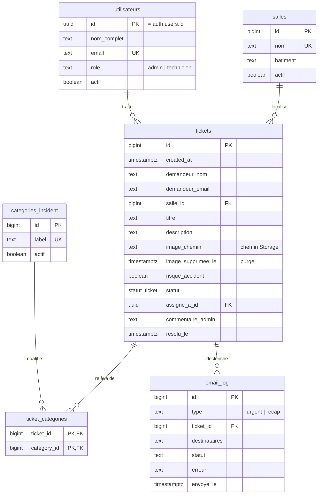

# 03 — Base de données

## Modèle de données



La table `configuration` (clé/valeur) complète le schéma : elle contient les URL
des fonctions « notifications » et « maintenance », le secret partagé et la
durée de conservation des photos (`retention_photos_mois`). Elle n'apparaît pas
dans le modèle métier car elle ne porte aucune donnée d'incident.

## Les tables

### `salles`

Salles pouvant faire l'objet d'un signalement. `nom` est unique : c'est la clé
utilisée par les QR codes et par le formulaire.

Une salle désaffectée passe à `actif = false` plutôt qu'être supprimée : la
contrainte `on delete restrict` sur `tickets.salle_id` empêche de supprimer une
salle qui porte un historique. Une salle inactive disparaît du formulaire mais
reste lisible sur les incidents passés.

Les administrateurs gèrent les salles depuis l'écran `/salles` de l'application
(politique `salles_gestion_admin`) ; le SQL reste possible en secours
([04 — Exploitation](04-exploitation.md#gérer-les-salles)).

### `categories_incident`

Types d'incident proposés en cases à cocher. Même logique d'activation.

### `utilisateurs`

Comptes du personnel. **L'identité vit dans `auth.users`**, géré par Supabase
Auth (mot de passe haché, jetons, réinitialisation). Cette table porte
uniquement ce que l'application ajoute : nom affiché, rôle, état actif.

`id` est une clé étrangère vers `auth.users(id)` avec `on delete cascade`. Un
déclencheur (`on_auth_user_created`) crée automatiquement la ligne à
l'inscription, en lisant `nom_complet` et `role` dans les métadonnées.

Il n'existe **pas** de table `profiles` séparée : deux tables « personnel »
signifieraient deux sources de vérité à maintenir synchronisées.

Les administrateurs gèrent les comptes depuis l'écran `/utilisateurs` de
l'application : rôle, activation, nom affiché. Trois garde-fous encadrent cet
écran, tous **en base** — l'interface ne fait que les refléter :

- un GRANT au niveau colonne limite l'écriture à `nom_complet`, `role` et
  `actif`. `email` reflète `auth.users.email` : le réécrire ici
  désynchroniserait l'annuaire de l'identité de connexion ;
- `insert` et `delete` sont retirés à `authenticated`. La création passe par
  Supabase Auth (le déclencheur fait le reste), et supprimer viderait en
  silence l'historique des affectations — `tickets.assigne_a_id` est en
  `on delete set null` — tout en laissant vivre la ligne `auth.users` ;
- le déclencheur `proteger_dernier_admin` refuse de retirer le dernier
  administrateur actif, que ce soit par rétrogradation ou par désactivation.
  Sans lui, un seul clic laisserait l'instance sans personne pour l'administrer.

### `tickets`

Cœur du modèle. Points à connaître :

- `image_chemin` stocke le **chemin de l'objet** dans le bucket, jamais une URL.
  Une URL signée expire au bout d'une heure : stockée en base, elle donnerait une
  image cassée le lendemain.
- `resolu_le` est renseigné **par un déclencheur** au passage en `TERMINE`, et
  effacé si le statut revient en arrière. Calculé en base et non côté
  application, pour que le délai moyen de résolution reste juste même si un
  statut est modifié depuis le SQL Editor.
- `image_supprimee_le` est renseigné par la purge automatique des photos
  ([04 — Exploitation](04-exploitation.md#photos--purge-automatique)) au moment
  où `image_chemin` est effacé. La fiche s'en sert pour distinguer « jamais de
  photo » de « photo supprimée ».
- Les contraintes `check` valident la longueur du titre et du nom, et le format
  de l'adresse e-mail — la validation du navigateur ne protège de rien.

### `ticket_categories`

Table d'association : un incident peut relever de plusieurs types (« Électricité »
**et** « Sécurité »). Clé primaire composite, suppression en cascade.

### `email_log`

Journal des envois. Volontairement étroit : ce n'est **pas** une table d'audit
générique (voir [ADR-009](adr/ADR-009-pas-de-table-audit.md)). C'est la seule
chose qui rende la question « les e-mails n'arrivent plus » diagnosticable.

`statut` vaut `envoye`, `echec` ou `simule` (mode console, aucun SMTP configuré).

## Le statut : un type énuméré

```sql
create type public.statut_ticket as enum ('NOUVEAU', 'EN_COURS', 'EN_ATTENTE', 'TERMINE');
```

L'ancien schéma stockait du français accentué en minuscules (`'terminé'`), ce
qui imposait une fonction de conversion avec suppression des accents, dupliquée
côté navigateur **et** côté serveur. Une faute de frappe ou un accent manquant
ramenait silencieusement le statut à « nouveau ».

Le type énuméré supprime ce risque : les valeurs sont identiques à celles
utilisées dans le code (`src/types/helpdesk.ts`), aucune conversion n'est
nécessaire, et la base **refuse** toute valeur inconnue au lieu de la corriger
en silence.

Les libellés affichés (« En cours ») sont définis une seule fois côté
application, dans `src/data/helpdesk.ts`.

## Sécurité : Row Level Security

### Modèle de menace

La clé publiable (`sb_publishable_…`) est intégrée au JavaScript envoyé à chaque
visiteur : n'importe qui peut la lire et interroger l'API directement, sans
passer par l'interface. **La sécurité ne repose donc pas sur ce que l'interface
affiche ou masque**, mais uniquement sur les règles ci-dessous.

Ce que doit garantir le modèle :

1. un visiteur anonyme peut déclarer un incident — c'est le principe même du QR
   code — mais ne peut lire **aucun** incident, ni aucun nom d'agent ;
2. un technicien peut lire, traiter **et supprimer** les incidents, mais pas
   réécrire le nom du déclarant ni la date de déclaration ;
3. le secret des notifications n'est lisible par aucun client.

### Politiques en vigueur

Relevé du 5 août 2026 (`select * from pg_policies where schemaname='public'`) :

| Table | Politique | Rôle | Opération |
| --- | --- | --- | --- |
| `salles` | `salles_lecture_anonyme` | `anon` | SELECT |
| `salles` | `salles_lecture_personnel` | `authenticated` | SELECT |
| `salles` | `salles_gestion_admin` | `authenticated` | ALL |
| `categories_incident` | `categories_lecture_anonyme` | `anon` | SELECT |
| `categories_incident` | `categories_lecture_personnel` | `authenticated` | SELECT |
| `categories_incident` | `categories_gestion_admin` | `authenticated` | ALL |
| `tickets` | `tickets_lecture_personnel` | `authenticated` | SELECT |
| `tickets` | `tickets_maj_personnel` | `authenticated` | UPDATE |
| `tickets` | `tickets_suppression_personnel` | `authenticated` | DELETE |
| `ticket_categories` | `ticket_categories_lecture_personnel` | `authenticated` | SELECT |
| `ticket_categories` | `ticket_categories_ecriture_personnel` | `authenticated` | ALL |
| `utilisateurs` | `utilisateurs_lecture_personnel` | `authenticated` | SELECT |
| `utilisateurs` | `utilisateurs_maj_soi_meme` | `authenticated` | UPDATE |
| `utilisateurs` | `utilisateurs_gestion_admin` | `authenticated` | ALL |
| `email_log` | `email_log_lecture_admin` | `authenticated` | SELECT |

Quatre observations qui méritent d'être comprises avant toute modification :

**`tickets` n'a aucune politique pour `anon`, et aucune politique d'INSERT.**
Ce n'est pas un oubli. La création passe exclusivement par la fonction
`creer_ticket()` (voir plus bas).

**`salles` et `categories_incident` sont lisibles sans authentification.**
Le formulaire public en a besoin pour afficher la liste des salles et les cases
à cocher, avant toute connexion. C'est intentionnel : ne les fermez pas sans
casser le parcours QR code.

**Les politiques de `anon` n'appellent aucune fonction.** `salles` a deux
politiques de lecture distinctes plutôt qu'une seule avec un `or`, car les
droits d'exécution sont vérifiés à la planification de la requête : une
condition `actif or public.est_personnel()` échouerait pour un visiteur anonyme
avec « permission denied for function est_personnel », **même quand `actif` est
vrai**. Ce piège a été rencontré et corrigé pendant le développement.

**Un refus de suppression ne ressemble pas à un refus.** Une politique DELETE
ne rejette pas la requête : elle ne lui fait correspondre aucune ligne.
PostgREST répond alors « succès, zéro ligne supprimée », que rien ne distingue
d'une suppression réussie — c'est ce qu'obtient un compte désactivé, ou un agent
dont le collègue vient de supprimer le même incident. Le service applicatif
redemande donc les lignes supprimées (`.delete().select('id')`) et traite une
réponse vide comme un échec, au lieu d'annoncer une suppression qui n'a pas eu
lieu. Même piège que le `Prefer: return=representation` du cahier de recette
(R-303).

### Colonnes modifiables

RLS ne sait pas restreindre les colonnes. La limitation passe par un privilège
au niveau colonne :

```sql
grant update (statut, assigne_a_id, commentaire_admin) on public.tickets to authenticated;
```

Sans cela, un technicien pourrait réécrire le nom du déclarant ou la date de
déclaration via l'API REST, en contournant simplement l'interface.

### Fonctions d'aide et récursion

Une politique posée sur `utilisateurs` qui interrogerait `utilisateurs` pour
connaître le rôle provoquerait une récursion infinie
(`infinite recursion detected in policy for relation "utilisateurs"`).

Les fonctions `est_personnel()`, `est_admin()` et `role_utilisateur()` sont
donc déclarées `security definer` : elles s'exécutent avec les droits de leur
propriétaire et contournent RLS, ce qui rompt le cycle.

Toutes portent `set search_path = public, pg_temp`. **C'est obligatoire sur
toute fonction `security definer`** : sans cela, un utilisateur peut placer un
schéma de son choix en tête du chemin de recherche et détourner les appels
exécutés avec des droits élevés.

### Pourquoi une fonction pour créer un incident

Donner à `anon` un droit d'`INSERT` sur `tickets` obligerait aussi à lui donner
un droit de `SELECT` — `insert ... returning` en a besoin — ce qui exposerait
tous les signalements du campus.

`creer_ticket(payload jsonb)` est `security definer` et accessible à `anon`.
Elle valide les champs obligatoires, le format de l'adresse e-mail, l'existence
de la salle et des catégories, puis insère le ticket **et** ses catégories dans
une seule transaction, et renvoie le numéro de demande.

Bénéfices : `anon` n'a aucun droit sur `tickets` ; la création est atomique
(l'ancienne version pouvait laisser un ticket sans catégorie si le réseau
tombait entre les deux requêtes) ; la validation est faite côté serveur.

Détail dans [ADR-003](adr/ADR-003-creation-par-fonction-rpc.md).

### Comment le vérifier

**Le piège à connaître :** sous RLS, une lecture interdite ne renvoie pas `403`
mais **`200` avec un tableau vide**. Une écriture interdite renvoie `204` sans
rien modifier. « Pas d'erreur, donc c'est sécurisé » est exactement l'inverse de
la vérité — et `[]` est indiscernable d'une table vide, ce qui rend le jeu de
démonstration indispensable au test.

```bash
bash scripts/verifier-rls.sh
```

22 contrôles, attendus tous verts. À relancer **après chaque migration touchant
aux politiques ou aux privilèges**. Deux règles pour tout test manuel :

- utiliser la clé **publiable** ; la clé secrète contourne RLS et ne prouve rien ;
- ne rien conclure du SQL Editor du tableau de bord : il s'exécute avec un rôle
  qui ignore RLS.

### En cas de verrouillage

Si une migration rend la base inaccessible :

- le **SQL Editor** du tableau de bord Supabase s'exécute avec un rôle
  privilégié et reste utilisable ;
- la clé `sb_secret_` (service) contourne RLS ;
- en local, `npm run db:reset` repart d'un état sain.

## Stockage des photos

Bucket **`incidents`**, **privé**.

| Paramètre | Valeur | Raison |
| --- | --- | --- |
| Visibilité | privé | Une photo prise en salle peut montrer des personnes ou du matériel (RGPD) |
| Taille maximale | 2 Mio | Une photo compressée pèse ~200 Ko ; la marge est large |
| Types acceptés | JPEG, PNG, WebP | Refus des autres formats côté serveur |
| Chemin | `<année>/<uuid>.jpg` | Le nom ne révèle rien et n'est pas devinable |
| Conservation | six mois après la déclaration | Purge nocturne par `pg_cron` et la fonction « maintenance » ; durée réglable dans `configuration` |

Politiques :

- `anon` et `authenticated` peuvent **déposer** (le formulaire public doit
  pouvoir joindre une photo sans connexion) ;
- seul le personnel connecté peut **lire** ;
- le personnel connecté peut **supprimer** — la photo doit pouvoir partir avec
  la fiche de l'incident ; aucune modification n'est possible en revanche, une
  photo jointe à un signalement ne doit pas pouvoir être remplacée après coup.
  La purge automatique, elle, passe par la clé de service, dans la fonction Edge.

L'affichage passe par une URL signée valable une heure, générée à l'ouverture de
la fiche.

> La compression faite dans le navigateur est un **confort d'usage, pas une
> mesure de sécurité** : un client modifié peut envoyer ce qu'il veut. Les
> limites réelles sont celles du bucket.

## Migrations

Les fichiers de `supabase/migrations/` sont la **source de vérité du schéma**.
Ils sont numérotés par horodatage et appliqués dans l'ordre.

```text
20260804090000_extensions_et_types.sql   extensions pg_net / pg_cron, type statut_ticket
20260804090100_tables_reference.sql      salles, categories_incident
20260804090200_utilisateurs.sql          comptes du personnel + déclencheur d'inscription
20260804090300_tickets.sql               tickets, ticket_categories, email_log, index
20260804090400_roles_et_helpers.sql      fonctions est_admin / est_personnel
20260804090500_rpc_creer_ticket.sql      création d'incident par les visiteurs anonymes
20260804090600_rls_politiques.sql        privilèges et politiques de sécurité
20260804090700_storage_incidents.sql     bucket des photos et ses politiques
20260804090800_notifications.sql         configuration, déclencheur urgent, tâche hebdomadaire
20260904090000_proteger_comptes.sql      GRANT de colonne sur utilisateurs, dernier administrateur protégé
20260904140000_purge_photos.sql          purge nocturne des photos, colonne image_supprimee_le
20260904160000_suppression_par_le_personnel.sql  DELETE des incidents et des photos ouvert aux techniciens
```

**Ne modifiez jamais une migration déjà appliquée en production** : ajoutez-en
une nouvelle. Modifier un fichier déjà joué crée une divergence silencieuse
entre le dépôt et la base.

Procédure pour en ajouter une :

```bash
npx supabase migration new <nom_explicite>
# éditer le fichier créé dans supabase/migrations/
npm run db:reset            # rejoue tout depuis zéro, en local
bash scripts/verifier-rls.sh   # obligatoire si la migration touche aux droits
npm run db:push             # applique au projet distant
```

> Le schéma de ce projet avait déjà été perdu une fois : les fichiers
> `database/*.sql` avaient été supprimés dans un commit antérieur, et la base
> n'existait plus que dans un projet hébergé. `supabase/migrations/` est
> l'artefact de reprise le plus important du dépôt : sans lui, rien n'est
> reproductible.
