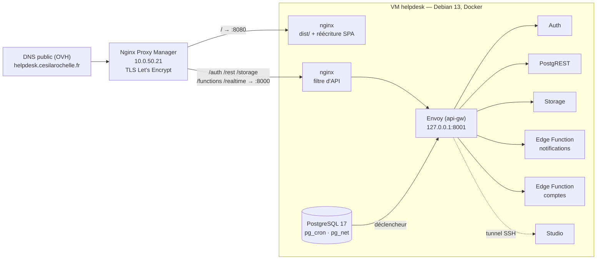

# 07 — Autohébergement

Faire tourner CESI Helpdesk sur l'infrastructure NumériLab — Proxmox et Nginx
Proxy Manager — à l'adresse **<https://helpdesk.cesilarochelle.fr>**, sans
dépendance à un service externe. Onze étapes, chacune avec sa commande et sa
vérification. Comptez deux heures la première fois, dont une bonne partie de
téléchargement.

Les valeurs à remplacer sont entre `<chevrons>`. Les identifiants du NumériLab
ne figurent nulle part dans le dépôt et ne doivent jamais y entrer.

## Ce qu'on installe

L'application est un site statique, mais elle repose sur la pile Supabase :
PostgreSQL avec RLS, Auth, Storage, une Edge Function Deno, `pg_cron` et `pg_net`.
Autohéberger, c'est donc faire tourner **la pile Supabase officielle en Docker**
sur une VM, servir `dist/` par un nginx, et publier le tout par NPM sous un seul
nom de domaine.



Quatre choix structurants :

- **Un seul nom de domaine.** `helpdesk.cesilarochelle.fr` existe déjà dans la zone
  DNS de l'établissement, et c'est le seul qui sera attribué. NPM route les cinq
  préfixes de l'API Supabase vers le port 8000 de la VM, tout le reste vers
  l'application. Même origine pour le front et l'API : pas de CORS, un seul
  certificat.
- **La passerelle Supabase n'est pas exposée directement.** Elle sert aussi Studio
  — le tableau de bord, accès complet à la base — sur `/`, derrière un simple mot
  de passe. Un nginx à nous ne laisse passer que `/auth`, `/rest`, `/storage`,
  `/functions` et `/realtime` ; tout le reste répond 404. Studio reste accessible
  par tunnel SSH.
- **L'inscription publique est fermée** (`DISABLE_SIGNUP=true`). Voir l'encadré
  de sécurité plus bas : ce n'est pas optionnel.
- **Le déclencheur d'alerte appelle la fonction en interne** (`http://api-gw:8000/…`
  sur le réseau Docker). Une alerte « risque d'accident » part même si le DNS
  public ou NPM sont en panne.

## Prérequis

| Élément | État constaté le 2026-09-02 | À faire |
| --- | --- | --- |
| DNS `helpdesk.cesilarochelle.fr` | existe : CNAME vers `cesilarochelle.fr` → `82.66.203.26` (zone chez OVH, `dns14.ovh.net`) | rien |
| Port 80 public → NPM | `curl -sI http://helpdesk.cesilarochelle.fr/` répond `Server: openresty` : c'est NPM. Le challenge HTTP de Let's Encrypt passera | rien |
| Port 443 public → NPM | **déjà redirigé** : `https://helpdesk.cesilarochelle.fr` répond depuis Internet (vérifié le 2026-09-03 depuis un réseau extérieur au labo) | rien |
| Adresse de la VM | `10.0.50.5` en DHCP, bail de 24 h renouvelé par `dhcpcd` qui redemande toujours la même adresse | fonctionne tel quel ; pour une garantie, demander une **réservation DHCP** sur la MAC de la VM au même gestionnaire |
| Quota Proxmox | — | 4 vCPU, 8 Go de RAM, 60 Go de disque |
| Accès | Proxmox `https://10.0.50.20:8006` (royaume `lldap`), NPM `http://10.0.50.21:81` | SSH vers la VM une fois créée |

> ### Diagnostiquer le 443 sans se tromper
>
> Un `openssl s_client` qui échoue sur le 443 **ne prouve pas** que le port est
> fermé : tant qu'aucun certificat ne correspond au nom demandé, NPM refuse la
> poignée de main TLS alors que la redirection fonctionne. Testez les deux
> séparément — la connexion TCP d'abord, le TLS ensuite :
>
> ```bash
> nc -z -w5 82.66.203.26 443 && echo "port ouvert"   # redirection en place ?
> echo | openssl s_client -connect helpdesk.cesilarochelle.fr:443 -servername helpdesk.cesilarochelle.fr 2>/dev/null | openssl x509 -noout -subject -dates
> ```
>
> Et vérifiez depuis un réseau **extérieur** au labo : depuis l'intérieur, une
> route locale ou le NAT en épingle peuvent réussir là où un visiteur échouerait.

Pour re-vérifier depuis n'importe quel poste :

```bash
nslookup helpdesk.cesilarochelle.fr 8.8.8.8      # → 82.66.203.26
curl -sI http://helpdesk.cesilarochelle.fr/ | head -3   # → Server: openresty
curl -skI https://helpdesk.cesilarochelle.fr/ | head -1 # → HTTP/2 … une fois le 443 ouvert
```

> ### ⚠️ Sécurité — pourquoi l'inscription doit rester fermée
>
> Le déclencheur `gerer_nouvel_utilisateur()`
> ([migration](../supabase/migrations/20260804090200_utilisateurs.sql)) lit le
> rôle dans les métadonnées **fournies par le client** à l'inscription. En local
> c'est sans conséquence. Sur Internet avec l'inscription ouverte, n'importe qui
> pourrait appeler `/auth/v1/signup` avec `{"data":{"role":"admin"}}` et obtenir
> un accès complet aux incidents, aux photos et aux statistiques.
>
> En production : `DISABLE_SIGNUP=true` (posé par `installer-supabase.sh`), et les
> comptes se créent depuis la VM avec `creer-compte-admin.sh`, par l'API
> d'administration et la clé de service. `scripts/creer-compte.sh` — qui passe par
> l'inscription publique — ne sert plus qu'en local. `verifier-deploiement.sh`
> contrôle que `/auth/v1/signup` répond bien « Signups not allowed ».

---

## 1. Créer la VM dans Proxmox

**Image.** Datacenter → nœud → stockage `local` → *ISO Images* → *Download from
URL* : l'ISO `debian-13.x-amd64-netinst.iso` depuis
<https://cdimage.debian.org/debian-cd/current/amd64/iso-cd/>.

**VM.** *Create VM*, puis onglet par onglet :

| Onglet | Réglages |
| --- | --- |
| General | Name `helpdesk`, *Start at boot* coché |
| OS | l'ISO Debian, type Linux |
| System | Machine `q35`, SCSI Controller `VirtIO SCSI single`, **Qemu Agent coché** |
| Disks | `scsi0`, 60 Go, *Discard* coché |
| CPU | 4 cores, type `host` |
| Memory | 8192 Mo |
| Network | Bridge `vmbr0`, modèle `VirtIO` |

**Installation Debian.** Nom d'hôte `helpdesk`, domaine vide, langue *English*,
pays *France* (locale `en_US.UTF-8`), clavier *American English* — voir ci-dessous.

Au moment des comptes : **laissez le mot de passe root vide**. Debian verrouille
alors le compte root et place l'utilisateur créé ensuite dans le groupe `sudo` —
c'est ce qu'attendent les scripts (`sudo bash deploy/scripts/installer-vm.sh`).

Pour le nom d'utilisateur, **`admin` est refusé** : Debian le réserve pour un
groupe système. Prenez `sysadmin` ou votre prénom ; c'est le `<utilisateur>` de
toutes les commandes `ssh` de ce document.

Partitionnement guidé sur tout le disque. À la sélection des logiciels :
**décochez l'environnement de bureau**, cochez *serveur SSH* et *utilitaires
usuels du système*. Gardez le **clavier américain** proposé par défaut : la console
noVNC de Proxmox transmet mal Maj et AltGr, un clavier français y rend les chiffres
inaccessibles. Choisissez donc un mot de passe **sans caractère AltGr** (`@`, `#`, `\`…)
et sans lettre parmi `a q z w m` si vous tapez sur un AZERTY — sinon il ne correspondra
pas à ce que vous croyez avoir saisi. Vous le remplacerez en SSH juste après.

**Adresse IP.** NPM doit viser une adresse stable. En DHCP, `dhcpcd` redemande à
chaque renouvellement l'adresse qu'il avait déjà : elle ne bouge donc pas en
pratique tant que la VM tourne, et c'est suffisant pour démarrer. Pour une
garantie, deux voies — une **réservation DHCP** sur le FortiGate du labo (à
demander au gestionnaire), ou une **IP statique** posée ici :

> ⚠️ Une IP statique doit être **hors du pool DHCP** du FortiGate. Ce pool n'est
> pas lisible sans accès à l'équipement : choisir une adresse au hasard risque un
> conflit le jour où le serveur DHCP l'attribue à une autre machine. Sans cette
> information, préférez le DHCP ou la réservation.

```text
auto ens18
iface ens18 inet static
    address 10.0.50.<X>/24
    gateway 10.0.50.254
    dns-nameservers 10.0.50.254
```

Notez cette adresse : elle est appelée `10.0.50.X` dans tout le document.

**Vérification :** l'onglet *Summary* de la VM affiche son IP (c'est l'agent QEMU
qui la remonte, il est installé à l'étape suivante) et `ssh <utilisateur>@10.0.50.X`
répond.

## 2. Préparer la VM

```bash
ssh <utilisateur>@10.0.50.X
sudo apt-get install -y git
sudo git clone <url-du-depot> /opt/cesihelpdesk && sudo chown -R "$USER" /opt/cesihelpdesk
cd /opt/cesihelpdesk
sudo bash deploy/scripts/installer-vm.sh
```

Le script installe Docker CE (dépôt officiel — la version Debian est trop
ancienne), Node 22, l'agent QEMU, règle le fuseau horaire et un pare-feu qui ne
laisse entrer que SSH. Déconnectez-vous puis reconnectez-vous pour que
l'appartenance au groupe `docker` soit prise en compte.

**Vérification :** `docker run --rm hello-world` s'exécute sans `sudo`.

> Les ports publiés par Docker contournent `ufw`. Le filtrage « seul NPM peut
> parler aux ports 8000 et 8080 » est donc fait dans le nginx de `deploy/web`,
> pas dans le pare-feu.

## 3. Installer la pile Supabase

```bash
bash deploy/scripts/installer-supabase.sh
```

Sans argument, le script prend `helpdesk.cesilarochelle.fr` pour l'application
et pour l'API ; passez un autre nom en argument si l'adresse change un jour.

Ce que fait le script, dans `/opt/supabase` :

1. clone le dossier `docker/` du dépôt `supabase/supabase` au tag épinglé
   (`self-hosted/v0.8.0`) et pose le fichier `.supabase-version` qu'attend
   l'outil de mise à jour amont ;
2. crée le `.env` : secrets et clés générés par l'outil amont
   (`utils/generate-keys.sh`), URL publiques, inscription fermée, e-mails
   auto-confirmés, et le bloc Helpdesk (`FUNCTION_SECRET`, destinataires,
   `MAIL_TRANSPORT=console`) ;
3. copie la surcouche `deploy/supabase-overlay/docker-compose.helpdesk.yml`, empilée
   sur le compose amont par `COMPOSE_FILE` — aucun fichier amont n'est modifié ;
4. télécharge les images et démarre la pile (`docker compose up -d --wait`).

La première fois, le téléchargement des images prend cinq à dix minutes.

Le script termine en affichant la clé `ANON_KEY` : c'est la valeur de
`VITE_SUPABASE_PUBLISHABLE_KEY` pour cette instance. C'est un JWT au rôle `anon`
— le format `sb_publishable_…` est propre au cloud Supabase ; `createClient`
accepte les deux ([src/lib/supabase.ts](../src/lib/supabase.ts)).

**Vérification :**

```bash
cd /opt/supabase && docker compose ps      # tout « healthy » ou « running »
curl -s http://127.0.0.1:8001/auth/v1/health   # {"version":…,"name":"GoTrue",…}
```

## 4. Appliquer les migrations et charger les données

```bash
cd /opt/cesihelpdesk
bash deploy/scripts/appliquer-migrations.sh          # production : salles et catégories
bash deploy/scripts/appliquer-migrations.sh --demo   # recette : + 12 incidents de démonstration
```

**L'ordre est imposé** : la pile doit tourner *avant* les migrations. La migration
`storage_incidents` écrit dans `storage.buckets`, table créée par le service
Storage à son premier démarrage. Le script attend qu'elle existe.

Les migrations passent par la CLI Supabase (`db push --db-url`, connexion directe
sur `127.0.0.1:5433`) : l'historique est tenu en base, relancer le script
n'applique que les nouvelles. La CLI demande confirmation avant d'appliquer.

Pour la recette, préférez `--demo` : les tests RLS ont besoin de vraies lignes
pour distinguer « refusé » de « vide ». Les tickets de démonstration se purgent
ensuite d'un `delete from public.tickets;`.

> `npm run db:reset` **efface la base**. Ne l'utilisez jamais contre cette instance.

**Vérification :** le script affiche le bucket `incidents` (privé, 2 Mio), la
tâche `recap-hebdomadaire` (`0 6 * * 5`) et les comptes de lignes.

## 5. Construire et servir le front

```bash
bash deploy/scripts/deployer-web.sh
```

Au premier passage, le script crée `.env.production` à partir du `.env` de la
pile (`VITE_SUPABASE_URL`, `VITE_SUPABASE_PUBLISHABLE_KEY`, `VITE_PUBLIC_APP_URL`),
refuse toute clé de service, construit `dist/` et démarre le conteneur nginx
(`deploy/web/`) qui expose :

- **8080** → l'application, avec `try_files … /index.html` (réécriture SPA) ;
- **8000** → le filtre d'API devant la passerelle Supabase.

Les deux ports n'acceptent que l'adresse de NPM (`10.0.50.21` par défaut ; à
changer dans `deploy/web/.env` si elle diffère).

Les variables `VITE_*` sont **figées à la compilation** : changer de domaine ou de
clé, c'est modifier `.env.production` puis relancer le script.

**Vérification (depuis la VM) :**

```bash
curl -s http://127.0.0.1:8080/ | grep -o '<title>[^<]*'          # CESI Helpdesk — …
curl -s -o /dev/null -w '%{http_code}\n' http://127.0.0.1:8000/  # 404 : Studio invisible
```

## 6. Publier dans Nginx Proxy Manager

Connexion sur `http://10.0.50.21:81`, puis *Hosts → Proxy Hosts → Add Proxy Host*.
Un seul proxy host, `helpdesk.cesilarochelle.fr` :

| Onglet | Réglages |
| --- | --- |
| **Details** | Scheme `http`, Forward Hostname/IP `10.0.50.X`, Forward Port `8080`. *Websockets Support* coché. *Block Common Exploits* **décoché** — ses règles s'appliquent à tout l'hôte, API comprise, et bloquent certaines requêtes PostgREST légitimes |
| **Custom locations** | cinq entrées, toutes en `http` vers `10.0.50.X` port **8000**, sans chemin dans le champ *Forward Hostname* : `/auth/` · `/rest/` · `/storage/` · `/functions/` · `/realtime/` |
| **SSL** | *Request a new SSL Certificate* (Let's Encrypt) + *HTTP/2 Support*. **Ne cochez pas encore *Force SSL* ni *HSTS*** — voir l'encadré ci-dessous |
| **Advanced** | rien à ajouter (vérifié sur NPM 2.13.5, qui pose déjà `client_max_body_size 0`) |

NPM génère pour chaque *custom location* un `location /rest/ { proxy_pass
http://10.0.50.X:8000; }` : l'URI arrive intacte au filtre nginx de la VM, qui ne
laisse passer que ces cinq préfixes vers Envoy. Le reste (`/`, `/incident/12`,
`/pg/`…) va au port 8080, donc à l'application.

Rien à mettre dans *Advanced* : NPM 2.13.5 pose `client_max_body_size 0` dans sa
configuration de base, un corps de 3 Mo traverse sans être coupé (vérifié). Le
plafond effectif reste celui de Storage, 2 Mio par photo. Si une version future de
NPM changeait ce défaut, un dépôt de photo échouerait en **413** : la parade est
alors `client_max_body_size 10m;` dans cet onglet.

> ### ⚠️ Ordre imposé : le certificat avant *Force SSL*
>
> Le challenge HTTP de Let's Encrypt n'a besoin que du **port 80**, déjà redirigé
> vers NPM : le certificat s'émet donc immédiatement. Mais cocher *Force SSL*
> avant que le **443** ne soit ouvert **rend le site injoignable** — le HTTP
> répondrait par une redirection vers un HTTPS qui n'arrive nulle part.
>
> Séquence : (1) demander le certificat, HTTP toujours servi ; (2) faire ouvrir le
> 443 sur le FortiGate ; (3) revenir cocher *Force SSL* et *HSTS Enabled*.

> La documentation Supabase décrit plutôt un hôte dédié à l'API
> (`api.<domaine>`). Ici un seul nom est disponible ; c'est pourquoi l'API vit
> sous des préfixes de chemin, et pourquoi `SUPABASE_PUBLIC_URL` et `SITE_URL`
> valent la même adresse. Rien dans l'application n'en dépend : le client
> Supabase reçoit une URL de base et construit `/auth/v1`, `/rest/v1`… dessous.

### Challenge Let's Encrypt

Le port 80 public arrive déjà sur NPM : le challenge HTTP fonctionne. Si NPM
affiche malgré tout une erreur d'émission, l'onglet SSL propose *Use a DNS
Challenge* avec le fournisseur **OVH** (jeton d'API à créer sur
<https://api.ovh.com/createToken/>, droits sur `/domain/zone/*`).

**Vérification :** `https://helpdesk.cesilarochelle.fr` affiche le formulaire de
déclaration avec un cadenas valide, et
`curl -s -o /dev/null -w '%{http_code}' https://helpdesk.cesilarochelle.fr/rest/v1/salles?select=nom -H "apikey: <ANON_KEY>"`
répond `200`.

## 7. Créer le compte administrateur

Sur la VM — l'API d'administration n'est joignable qu'en local :

```bash
bash deploy/scripts/creer-compte-admin.sh admin@viacesi.fr '<MotDePasseSolide123!>' "<Prénom Nom>" admin
```

Le quatrième argument est `admin` ou `technicien`. Relancé avec un e-mail
existant et deux arguments, le script **réinitialise le mot de passe** — c'est
la procédure de récupération tant qu'aucun SMTP n'envoie les liens.

**Vérification :** connexion sur `https://helpdesk.cesilarochelle.fr/connexion`,
puis le tableau de suivi s'affiche (vide, ou avec les 12 incidents de
démonstration).

## 8. Activer les notifications

```bash
bash deploy/scripts/configurer-notifications.sh --tester
```

Le script écrit dans `public.configuration` l'URL **interne** de la fonction
(`http://api-gw:8000/functions/v1/notifications`) et le `FUNCTION_SECRET` du
`.env`, puis — avec `--tester` — déclenche un récapitulatif et affiche
`email_log`.

Le transport reste `console` : les e-mails sont composés et journalisés
(`statut = 'simule'`), pas envoyés. Le passage au SMTP réel est décrit plus bas
et ne demande aucun redéploiement.

**Vérification :** déclarez un incident en cochant « Risque d'accident » ; une
ligne `urgent` apparaît dans `email_log` et le corps du message dans
`docker logs supabase-edge-functions --tail 40`.

## 9. Vérifier

Depuis la VM ou n'importe quel poste :

```bash
bash deploy/scripts/verifier-deploiement.sh helpdesk.cesilarochelle.fr
```

Cinq familles de contrôles : inscription fermée, Studio invisible, réécriture SPA,
TLS et redirection, API à travers NPM et le filtre. Attendu : **0 échec**.

Puis les 22 tests RLS du dépôt, contre l'instance déployée — ils exigent le jeu
de démonstration et le compte admin créé à l'étape 7 :

```bash
SB_URL=https://helpdesk.cesilarochelle.fr SB_ANON=<ANON_KEY> \
ADMIN_EMAIL=admin@viacesi.fr ADMIN_PASSWORD='<mot-de-passe>' \
  bash scripts/verifier-rls.sh
```

Attendu : **22 réussites, 0 échec**.

Enfin le [cahier de recette](06-recette.md) **depuis un téléphone en 4G**, hors du
Wi-Fi du campus : c'est le seul test qui prouve la chaîne complète — scan d'un QR
code imprimé depuis `/qr-codes`, déclaration avec photo, alerte dans `email_log`,
traitement côté admin.

## 10. Studio

Le tableau de bord n'est pas exposé sur Internet. Depuis votre poste :

```bash
ssh -L 8001:127.0.0.1:8001 <utilisateur>@10.0.50.X
```

puis <http://localhost:8001>. Identifiants : `grep DASHBOARD /opt/supabase/.env`
sur la VM. Le *SQL Editor* de Studio remplace celui du cloud pour toutes les
procédures de [04 — Exploitation](04-exploitation.md).

Alternative sans interface :

```bash
docker exec -it supabase-db psql -U postgres -d postgres
```

## 11. Sauvegardes

```bash
sudo crontab -e
# 30 2 * * * /opt/cesihelpdesk/deploy/scripts/sauvegarder.sh >> /var/log/helpdesk-sauvegarde.log 2>&1
```

Chaque nuit dans `/var/backups/helpdesk` (lisible par root seulement) : dump des
schémas `public`, `auth`, `storage` et `supabase_migrations` ; archive des photos
(`volumes/storage`) ; copie du `.env` (les clés — sans elles, le dump est
inutilisable) ; rotation à 14 jours. Doublez avec une sauvegarde **vzdump** de la
VM planifiée côté Proxmox (*Datacenter → Backup*).

**Restauration** sur une pile fraîche — étapes 2 et 3 faites, étape 4 **non** :

```bash
cd /opt/supabase
cp /var/backups/helpdesk/env-<date> .env && docker compose up -d --wait   # mêmes clés qu'à l'origine
docker compose stop auth rest storage realtime functions
docker exec -i supabase-db pg_restore -U postgres -d postgres --clean --if-exists --no-owner \
  < /var/backups/helpdesk/base-<date>.dump
tar -xzf /var/backups/helpdesk/storage-<date>.tar.gz -C /opt/supabase/volumes
docker compose up -d --wait
```

Testez cette restauration une fois, sur une VM jetable, avant d'en avoir besoin.

---

## Exploitation au quotidien

Les procédures de [04 — Exploitation](04-exploitation.md) restent valables ;
voici ce qui change quand la pile est autohébergée.

| Dans 04 — Exploitation | Sur l'instance autohébergée |
| --- | --- |
| *SQL Editor du tableau de bord* | Studio par tunnel SSH (§ 10), ou `docker exec -i supabase-db psql -U postgres -d postgres` |
| `npx supabase secrets set X=Y` | éditer `/opt/supabase/.env`, puis `cd /opt/supabase && docker compose up -d functions` |
| `npx supabase functions deploy notifications` | rien : les fonctions sont montées depuis `/opt/cesihelpdesk/supabase/functions`. Après un `git pull` : `docker compose restart functions` |
| *Authentication → Users → Add user* | menu **Comptes** de l'application, encadré « Inviter un utilisateur ». En dépannage : `bash deploy/scripts/creer-compte-admin.sh …` (§ 7) |
| *SQL : changer un rôle, désactiver un compte* | menu **Comptes** de l'application |
| *Send password recovery* | menu **Comptes**, bouton « Lien mot de passe » — le lien est transmis à la main, Auth n'ayant pas de relais SMTP. En dépannage : `bash deploy/scripts/creer-compte-admin.sh <email> <nouveau-mot-de-passe>` |

### Mettre à jour l'application

```bash
cd /opt/cesihelpdesk && git pull
bash deploy/scripts/appliquer-migrations.sh   # n'applique que les nouvelles migrations
bash deploy/scripts/deployer-web.sh           # reconstruit dist/ ; le conteneur le voit aussitôt
cd /opt/supabase && docker compose restart functions   # si supabase/functions/ a changé
```

> **Une fonction NOUVELLE ne suffit pas d'un `restart`** : elle arrive avec un
> montage supplémentaire dans `docker-compose.helpdesk.yml`, que seule une
> recréation du conteneur prend en compte. Recopiez la surcouche et recréez :
>
> ```bash
> cp /opt/cesihelpdesk/deploy/supabase-overlay/docker-compose.helpdesk.yml /opt/supabase/
> cd /opt/supabase && docker compose up -d functions
> ```
>
> C'est le cas de la fonction « comptes » (invitation et lien de mot de passe),
> ajoutée après la première mise en production.

### Passer aux e-mails réels

Deux scripts font tout le travail. Ne modifiez pas `/opt/supabase/.env` à la
main : le mot de passe s'y retrouverait dans l'historique du shell.

```bash
# 1. Bascule (la clé est demandée à l'invite, jamais en argument)
ssh -t <utilisateur>@10.0.50.X "cd /opt/cesihelpdesk && \
  bash deploy/scripts/basculer-smtp.sh <hote> <port> <utilisateur> <expediteur> 'CESI Helpdesk'"

# 2. Contrôle du transport, vers UNE adresse à vous
bash deploy/scripts/tester-smtp.sh <votre-adresse>
```

Ces variables sont **partagées** avec Supabase Auth : après bascule, ses propres
e-mails (récupération depuis Studio, changement d'adresse) partent aussi. Les
liens d'invitation et de mot de passe de l'application, eux, restent transmis à
la main et ne dépendent pas de ce réglage. `basculer-smtp.sh` sauvegarde le
`.env`, refuse les valeurs invalides, puis redémarre `auth` et `functions`.

**Quel relais ?** Le FortiGate du labo laisse sortir 587 et 465 ; Gmail,
Microsoft 365 et Mailjet sont joignables depuis la VM. **Mailjet est le relais
retenu pour cette instance.**

| Relais | Réglages | Ce qu'il faut préparer |
| --- | --- | --- |
| **Mailjet** — retenu ici | `in-v3.mailjet.com` port **465** (TLS direct — **pas 587** : denomailer 1.6.0 plante sur STARTTLS et tue le worker), utilisateur = **API Key**, mot de passe = **Secret Key** (*Account → REST API → SMTP*) | valider une adresse expéditrice : un clic sur un lien reçu dessus, **aucun enregistrement DNS**. 200 envois/jour en offre gratuite. Un expéditeur en `@gmail.com` relayé par un tiers échoue le SPF de `gmail.com` : regardez le dossier indésirable au premier envoi |
| **Gmail** | `smtp.gmail.com` port **465**, utilisateur et expéditeur = votre adresse Gmail | la validation en deux étapes sur le compte Google, puis un **mot de passe d'application** (<https://myaccount.google.com/apppasswords>). Aucune validation d'adresse ni de domaine, et SPF/DKIM/DMARC passent puisque Google envoie du Gmail. ~500 destinataires/jour |
| **Relais de l'établissement** | fourni par le service informatique | le SPF de `cesilarochelle.fr` inclut déjà `spf.mailjet.com` : une clé sur leur compte permettrait un expéditeur `helpdesk@cesilarochelle.fr`, sans toucher au code — seules `SMTP_USER`, `SMTP_PASS` et `SMTP_ADMIN_EMAIL` changeraient |

> ⚠️ **Deux pièges.** `SMTP_HOST=supabase-mail` dans le `.env` amont désigne un
> service **absent** de la pile : le laisser tel quel fait échouer l'envoi sur une
> résolution DNS (le code et les scripts refusent maintenant cette valeur). Et
> `email_log.statut = 'envoye'` signifie « **accepté par le relais** », pas
> « distribué » : un rebond apparaît chez le relais, jamais dans la base.

**Changer les destinataires** — `ALERT_RECIPIENTS` (alerte immédiate) et
`WEEKLY_RECIPIENTS` (récapitulatif), séparés par des virgules, dans
`/opt/supabase/.env` ; puis `docker compose up -d functions`. Pris en compte au
prochain envoi.

### Mettre à jour la pile Supabase

Sauvegarde d'abord, puis l'outil amont, qui fusionne sans toucher au `.env`, à la
surcouche ni aux données :

```bash
bash /opt/cesihelpdesk/deploy/scripts/sauvegarder.sh
cd /opt/supabase
sh update.sh --dry-run          # aperçu
sh update.sh                    # ou : sh update.sh --to self-hosted/v0.9.0
sh run.sh pull && sh run.sh recreate
bash /opt/cesihelpdesk/deploy/scripts/verifier-deploiement.sh
```

Mettez ensuite à jour `SUPABASE_REF` dans `deploy/scripts/installer-supabase.sh`
pour que la prochaine installation parte de la même version.

---

## Dépannage

| Symptôme | Cause la plus fréquente |
| --- | --- |
| **403** sur `https://helpdesk.cesilarochelle.fr` | l'adresse de NPM n'est pas `10.0.50.21` : renseignez `NPM_IP` dans `deploy/web/.env` puis `docker compose -f deploy/web/docker-compose.yml up -d` |
| **502** dans NPM | conteneur `helpdesk-web` arrêté (`docker ps`), ou mauvaise IP/port dans le proxy host |
| Le navigateur n'atteint pas le site en HTTPS alors que le certificat est émis | le port 443 public n'arrive pas sur NPM — voir les prérequis |
| Écran « Configuration manquante » | `dist/` construit sans `.env.production` — relancez `deployer-web.sh` |
| Erreurs CORS ou `Invalid API key` dans la console du navigateur | `VITE_SUPABASE_URL` ne correspond pas à `SUPABASE_PUBLIC_URL` (http/https, domaine), ou l'`ANON_KEY` a été régénérée après le build |
| L'API répond **200** avec la page de l'application (HTML) | une *custom location* manque ou a un chemin dans *Forward Hostname* : les cinq préfixes doivent pointer nus vers le port 8000 |
| Photo refusée, **413** | limite de corps de NPM : ajouter `client_max_body_size 10m;` dans l'onglet Advanced du proxy host |
| Site injoignable juste après avoir activé le HTTPS | *Force SSL* coché alors que le 443 n'arrive pas sur NPM : décochez-le en attendant l'ouverture du port |
| Requêtes PostgREST bloquées (**403** aléatoires sur `/rest/v1`) | *Block Common Exploits* coché sur l'hôte qui sert l'API |
| `Signups not allowed` à la connexion | normal pour `/signup` ; si c'est au `/token`, le compte n'existe pas — § 7 |
| Aucune ligne dans `email_log` après un incident à risque | `select * from net._http_response order by id desc limit 5;` montre la réponse de la fonction ; `public.configuration` vide → § 8 |
| `email_log.statut = 'echec'` | la colonne `erreur` contient le message SMTP ; en mode console, un `echec` signifie « aucun destinataire » |
| Récapitulatif jamais reçu | `select * from cron.job_run_details order by start_time desc limit 5;` — pg_cron tourne en **UTC** |
| Un service `unhealthy` | `cd /opt/supabase && docker compose logs <service> --tail 100` |
| Les migrations échouent sur `storage.buckets` | la pile n'était pas démarrée — § 4, l'ordre est imposé |
| `!override` refusé par Compose | Docker Compose < 2.24 : installez depuis le dépôt Docker (`installer-vm.sh`) |
